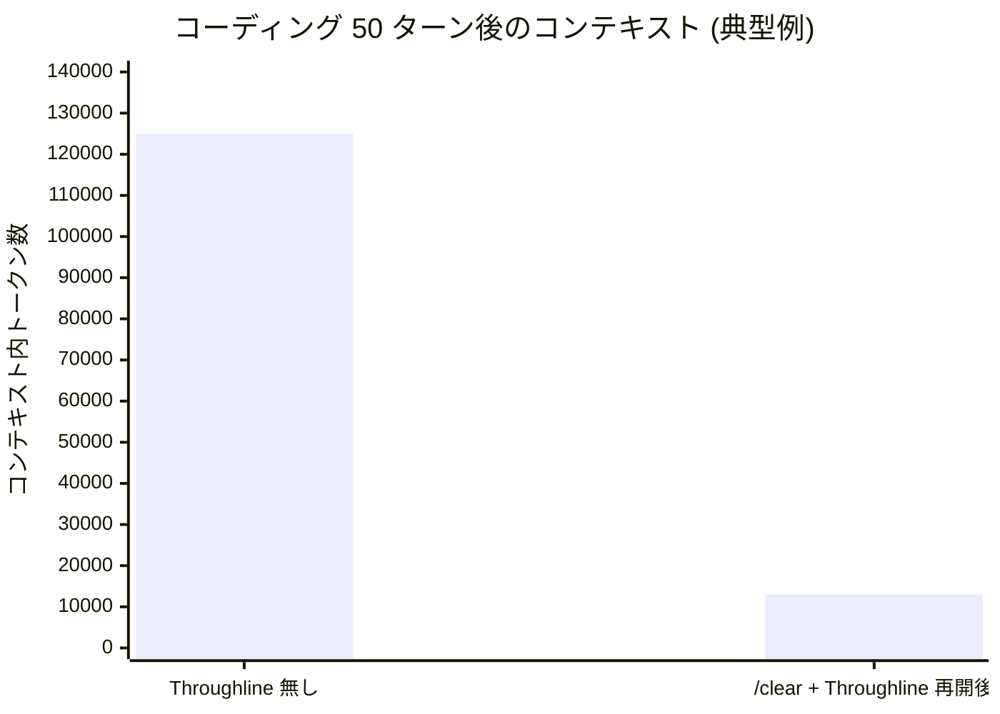
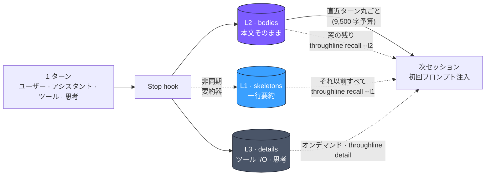
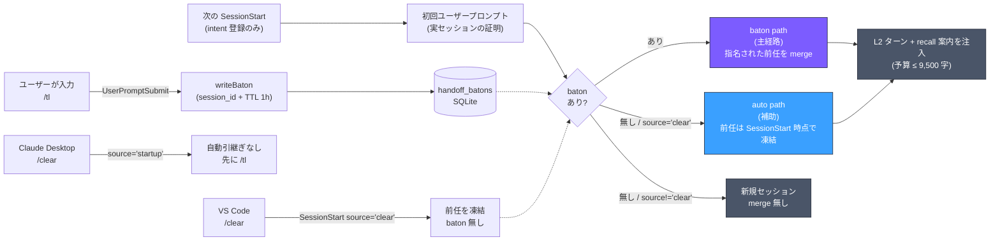

<p align="center">
  
  <br>
  <sub><em>この画像は、環境や境界が変わっても、関係・方向・記憶を失わずに進み続ける連続性を表しています。</em></sub>
</p>

# Throughline

[](https://www.npmjs.com/package/throughline)
[](LICENSE)
[](https://nodejs.org)
[](https://github.com/kitepon/Throughline/actions/workflows/test.yml)

[English](README.md) · **日本語**

> **Claude Code のコンテキスト消費を約 90% 削減しつつ、記憶はほぼそのまま残す。**
> 「時間の新旧」ではなく **「コンテンツの種類」** で会話を分離する。人間が読みたいテキストは残し、機械が出力したツール I/O は SQLite に退避する。同じ判断、同じ文脈、9 割軽量。

[kitepon.dev](https://kitepon.dev/)を運営する[クオ（@QLyun35332）](https://x.com/QLyun35332)が
開発・メンテナンスしています。

## 所有境界

本repositoryは導入、設定、状態、schemaとmigration、診断、復旧、更新、release判断を
所有します。Throughlineは文書化したCLIだけで単独運用でき、工場の制御装置を必要としません。
[dotagents](https://github.com/kitepon/dotagents)はkitepon.dev開発工場への配線と統合契約を
担当しますが、Throughlineの状態や製品寿命を所有・制御しません。
MarkItDownは別区分の第三者CLIです。

## 30 秒で始める

```bash
npm install -g throughline
throughline install     # hook / Codex skill / VS Code monitor task を登録
```

これだけ。Claude Code のセッションを開けば、以後すべてのターンが
`~/.throughline/throughline.db` に自動で流れていく。VS Code では `/clear` 後の
`SessionStart source='clear'` から自動で再開する。Claude Desktop はその source を
送らないため、`/clear` の前に `/tl` を実行する。新規 chat や再起動でも、前任を
確定的に指名したいときは境界の前に `/tl` を使う。

Grok Desktop も first-class host である。`throughline install` は
`~/.grok/hooks/throughline.json` を書く。Grok では `/tl` は今の窓へ注入せず、
新しい Terminal 席を立てる。

Cursor も first-class host である。`throughline install` は `~/.cursor/hooks.json`
へ sessionStart / beforeSubmitPrompt / stop を upsert し、工場 hook は残す。
capture は Cursor の `agent-transcripts` jsonl。注入は sessionStart の
`additional_context`。`/tl` 後継の自動起動はしない。
[ADR 0022](docs/adr/0022-cursor-host-capture.md) を正とする。

<details>
<summary><b>Grok も併用する場合</b> Grok hooks も登録される — クリックで詳細</summary>

global install は `~/.grok/hooks/throughline.json` に絶対 `node` +
installed `bin/throughline.mjs` の SessionStart / UserPromptSubmit / Stop を書く。
bare `throughline` は書かない（Grok Desktop の GUI PATH では見えない）。

ターンは `grok:<sessionId>` として保存し、L2 は
`~/.grok/sessions/<encodeURIComponent(cwd)>/<id>/chat_history.jsonl` から回収する。
Grok は UserPromptSubmit stdout や書き換えた `chat_history.jsonl` をライブ
モデル文脈へ入れない。

L2 がある Grok 席で `/tl` を打つと、バトンを書いたあと次を副作用起動する:

```bash
throughline grok-continue --session grok:<id>
```

cwd は源セッションの `project_path` であり、呼び出し元 cwd は使わない。
初手 user 文は前文 + handoff-context 本文 + 続き + 待機。context /
`project_path` が無ければ spawn しない。Claude / Codex の `/tl` と Grok の
`/clear` では起動しない。aiterm / `--rules` / `--from` は使わない。
macOS Terminal のみ。

通常のhandoff-contextは、引き継いだことを最初の応答で一度だけ案内し、後続応答では
繰り返させない。埋込製品は`handoff-context --disclosure silent`で案内を消せる。
project束縛済み補足の`handoffDisclosure: "silent"`も同じ扱いになる。旧版がassistant本文へ
付けた固定宣言は次回引き継ぎから除外し、ユーザーの
引用と実際の応答本文は保持する。

新席は `~/.grok/sessions/<encodeURIComponent(cwd)>/` のトップレベル
ディレクトリ。Desktop の Inactive 畳みは成功条件にしない。L2 が無い源
（`merged_into` チェーンの空席など）では起動しない。新しい chat で 1〜2
往復してから `/tl` する。

</details>

<details>
<summary><b>Codex も併用する場合</b> Codex hooks も登録される — クリックで詳細</summary>

global install は Codex の `UserPromptSubmit` / `PostToolUse` / `Stop` hook
（絶対 node パス登録）と `$throughline` skill も登録する。これらの hook は
rollout capture と monitor state 書き込みだけを行い、**使用量閾値での
`$throughline` 自動注入はしない**（token-monitor は表示専用）。bare
`$throughline` は app-server 経由で新規 Codex thread を開始し、Throughline DB
の handoff memory を developer item として注入する。このとき現在のCodex UI surfaceから
Desktop／VS Code／CLIを選び、対応する`--open-host`を明示する。shellや永続PTYから継承した
環境変数はsurface判定に使わない。`auto`はsurfaceが本当に不明な直接CLI利用時だけの互換経路。
current-thread rollback
診断が要る時だけ明示的に `trim --execute --host codex` を使う。既存の
非 Throughline Codex hook は保持される。

登録後は `throughline doctor --codex` で承認状態も確認する。未承認のフックは
Codexのフック承認画面で利用者が承認する。Throughlineは承認状態を書き換えない。
Windowsの起動条件と、記録が見つからない場合の確認手順は
[Codexの診断と復旧](README.md#codex-windows)を参照。

</details>

## 他の手段との比較

| | **Throughline** | `/clear` (組み込み) | `/compact` (組み込み) | MemGPT / SummaryBufferMemory |
|---|---|---|---|---|
| **何をする** | ツール I/O を SQLite に退避、本文は残す | ウィンドウを全消去 | ウィンドウ全体を LLM 要約 | 新旧で要約 |
| **圧縮の軸** | コンテンツの **種類** (テキスト vs ツール I/O) | 無し — 全消去 | **新旧** (一律) | **新旧** (一律) |
| **境界後に残る記憶** | ✅ 直近ターン本文そのまま (予算内ターン原子詰め) + それ以前は `recall` で pull + L3 オンデマンド | ❌ ゼロ | △ 一個の要約 (情報欠落) | △ 要約 (情報欠落) |
| **ツール I/O の扱い** | L3 に退避、`/sc-detail HH:MM:SS` で取り戻せる | 消える | 要約に溶けて読めない | 要約に溶ける |
| **コーディング用途への適合** | 高 — ツール I/O こそ重い 80% | 低 — 文脈が切れる | 中 — ただし不可逆 | 中 |
| **誤継承リスク** | 低 (`/tl` は前任を指名、VS Code `/clear` はtranscriptのある候補を凍結) | n/a | n/a | 高 |
| **ランタイム依存** | **ゼロ** (Node 22.13+ 同梱の `node:sqlite`) | n/a | n/a | 多数 |
| **マルチセッション トークン監視** | ✅ 実測 `message.usage` / Codex rollout `token_count` | — | — | — |

**ひとことで**: `/clear` は全部捨てる、`/compact` は全部混ぜる、Throughline は **書いた本文はそのまま残し、ツール出力 (= 80% の重量物) だけ退避** する。

<details>
<summary><b>なぜこれが効くのか — 80% ツール I/O 問題</b></summary>

通常の Claude Code セッションでは、**コンテキストの 80% はツール I/O** です —
ファイル読み込み、Bash 出力、grep 結果。これらは Claude が即座に消費するデータですが、
コンテキスト上には永久に残り、ウィンドウ上限に向かって押し出されていきます。



```
Throughline 無し (50 ターン、/clear なし):
  ユーザー / アシスタント本文  ~25,000 tok  ████
  ツール I/O (80%)            ~100,000 tok  ████████████████
                              ≈ 125,000 tok 合計

Throughline 有り (50 ターン → /clear → 再開):
  再開注入                     ~3,000 tok  ▌  (直近 L2 ターン丸ごと、≤9,500 字)
  それ以前の記憶            0〜10,000 tok     (必要な時だけ recall --l2 / --l1 で pull)
  ツール I/O                       0 tok     (SQLite 退避、detail でオンデマンド取得)
                              ≈ 最大 13,000 tok — 90% 軽量
```

MemGPT や LangChain の SummaryBufferMemory が **新旧** で圧縮するのに対し、
Throughline は **コンテンツの種類** で分離します。人間が読むべき会話は残し、
機械が生成した一過性のツール出力は退避する。コーディングアシスタント向けに
特化した設計です。

退避された L3 は失われていません。過去ターンのツール出力が再び必要になれば、
Claude は `throughline detail <時刻>` で取り戻せます。

Throughline は加えて、トランスクリプト JSONL から実測 API 使用量を読む
**マルチセッション トークン監視ツール** も同梱しています (`length / 4` 推定は使いません)。

</details>

---

## 3 層メモリーモデル (schema v9)



| 層 | 名称 | 保存先 | 内容 | ターンあたりコスト |
| --- | --- | --- | --- | --- |
| **L1** | スケルトン | `recall --l1` でオンデマンド pull | ターンの一行要約（既定 backend は Codex CLI `gpt-5.6-luna`、fallback は ADR 0015 参照） | 約 10 トークン |
| **L2** | ボディ | 予算内は注入、残りは `recall --l2` | ユーザー本文 + アシスタント返答そのまま | 自然なフルサイズ |
| **L3** | ディテール | SQLite のみ | ツール I/O、システムメッセージ、画像、**拡張思考** (オンデマンド) | 重い、退避済 |

3 層は **互いに補完的かつ排他的** で、重複保存はありません。
拡張思考ブロックは L3 (`kind='thinking'`) に格納されるので、次セッションは
**前セッションの Claude が中断時に何を考えていたか** を、発話だけでなく
内省レベルで参照できます。思考は注入されず、`throughline detail <時刻>` で
いつでも取得できます。

次セッションの **初回ユーザープロンプト** 時（二相ハンドオフ、ADR 0014）、
Throughline は SQLite からコンテキストを再構築し、プレーンテキストとして
注入します（push/pull 設計、ADR 0016）:

- **直近ターン** を L2 (`bodies`) のフル本文として注入 — 新しい順に
  ターン丸ごと（user + assistant 原子）、約 9,500 字の予算に入るだけ
- **L1 (`skeletons`) の一行要約は注入しません** — 代わりに、そのまま実行
  できる `throughline recall --l2|--l1` コマンド入りの案内セクションを注入し、
  古い記憶は必要になった時だけ pull します
- L3 は SQLite に残り、`/sc-detail <時刻>` でオンデマンド取得

L1 要約は遅延実行で、20 ターン未満で終わるセッションでは外部要約器を呼ばず、
短いタスクの要約コストはゼロです。要約は **削減割合**（既定 1/5、
`THROUGHLINE_L1_RATIO` で変更可。不正値は明示エラー）を目標にします。
Claude-primary 経路のbackend順は **Codex CLI**（既定 `gpt-5.6-luna`@`low`、実測評価で選定 — ADR 0015。
`THROUGHLINE_L1_MODEL` / `THROUGHLINE_L1_EFFORT` で変更可）→ **Claude Haiku 4.5**
（`claude -p` サブプロセス、Claude Max のログイン認証流用）で、API キーは
不要です。各段の失敗理由は記録されます。

3 層 (L1/L2/L3) の書き込みパスは schema v5 から動作しています。
`/sc-detail HH:MM:SS` はユーザー / アシスタント本文 (L2) と、そのターンで
L3 に保存された `kind` 別 (ツール入力 / ツール出力 / hook 出力) を返します。

---

## 引き継ぎ: `/tl` はbaton、VS Code `/clear` は `source='clear'`

引き継ぎは2経路です。`/tl` のbatonは前任をsession idで確定指名します。
適格なbatonが無い場合だけ、VS Code `/clear` の `SessionStart source='clear'` から
transcriptのある前任を1件凍結します。消費時はbatonを先に確認します。



### baton path: `/tl`

ユーザーが `/tl` を実行すると、UserPromptSubmit hook が**そのセッションの**
`session_id` を `handoff_batons` に書きます。次の新セッション
は **初回ユーザープロンプト時** に baton を消費し（適格性: セッション誕生が baton
書き込みから TTL 1 時間以内）、その前任を確定的に merge します。
複数ウィンドウでも指名された前任だけを引き継ぎます。

なぜ SessionStart でなく初回プロンプトか: Claude Code は同一 project に数百 ms の
間隔で複数の SessionStart を発火させることがあり、その一部は transcript を一切
作らない**幽霊セッション**になります。SessionStart 時点では実体と幽霊を判別
できないため、baton を SessionStart で消費すると幽霊が記憶を飲み込み、実セッション
が空で始まる事故が起きます。幽霊はプロンプトを発火しないので、消費を初回
プロンプトへ遅延させればこの事故は構造的に起きません（二相ハンドオフ、ADR 0014）。

### auto path: VS Code `source='clear'`

組み込み `/clear` は、実測したどの Claude Code クライアントでも
UserPromptSubmit hook に届きません。VS Code は代わりに SessionStart の
`source='clear'` を送ります。baton が無い場合だけ、同 project の
最新 Claude predecessor を **SessionStart 時点で** 解決・凍結し（transcript の
無い幽霊は候補から除外）、merge + 注入は初回プロンプト時に行います。

`THROUGHLINE_DISABLE_AUTO_HANDOFF=1` はこのauto pathだけをOFFにし、明示 `/tl` の
batonは止めません。

Claude Desktop は組み込み `/clear` をUserPromptSubmitへ渡さず、SessionStartでも
`source='clear'` を送りません。Desktopでは `/clear` の前に `/tl` を実行します。
対照実測とupstream報告はarchiveの
[`docs/12_desktop_clear_handoff_plan.md`](docs/archive/12_desktop_clear_handoff_plan.md)にあります。

```
/tl:      Session A → /tl → (/clear・新chat・再起動) → Session B (Aのbatonを消費)
VS Code:  baton無し + /clear source='clear' → transcriptのある直近前任をmerge
```

### 注入されるもの

両経路で同じ curated memory が注入されます（push/pull 設計、ADR 0016）:

- **「現在地」アンカー** (v0.4.12〜) — 最新のユーザー指示と最新の assistant turn を
  ヘッダ直下に再掲（各 600 字で切り詰め）
- **pull 案内セクション**（無条件表示）— そのまま実行できる `throughline recall`
  コマンド。session id・ISO ms 境界・件数は注入時に焼き込み済み
- L2 verbatim — 約 9,500 字の注入予算に入るだけ、新しい turn からターン丸ごと
  詰める（典型 7〜8 turn、軽い会話ならもっと多い）。**L1 サマリーは注入しません**
  — 20 turn 窓の残りは `recall --l2` で全文、それより古い全 turn は `recall --l1`
  で取得（要約済みは L1 行、未要約は `throughline detail` への誘導付きで明示）
- L3 references (`throughline detail <時刻>` で引き出すコマンド、各 L2 行末尾に
  inline 付記。本文は SQLite に残置)

注入は **「中断されたタスクの再開」** として再フレーミングされます。L2 verbatim に
最終 assistant turn (= 次に何をしようとしていたか) が含まれるため、別途 memo /
extended thinking セクションは注入されません。

各マージ行は `origin_session_id` を保持するので、繰り返し引き継ぐと
記憶がチェーン状に蓄積します:

```text
VS Code:
S1 (4 ターン) --/clear--> S2 (S1 を auto-merge + 3 ターン追加) --/clear--> S3 (S2 を auto-merge + 5 ターン追加)
                          origin=S1×4                                    origin=S1×4, S2×3, S3×5
```

---

<details>
<summary><b>Codex trim</b> — operator 向け詳細 (クリックで展開)</summary>

## Codex trim

Throughline の主軸は引き続き **Claude Code** です。Codex 対応は、Claude hooks /
slash command / transcript / baton / resume behavior を置き換えるものではなく、
adapter / projection として追加されます。

現時点で core Throughline が外部モデルを呼ぶのは L2→L1 要約だけです。
backend順はCodex CLI（既定`gpt-5.6-luna`）→ Claude Haikuです（ADR 0015）。

Codex 側 trim (= same-thread context trim) は、診断・実験として明示した場合だけ
`throughline trim --execute --host codex` で発火します。bare `$throughline` は
`codex-handoff-start` による新スレッド handoff で、current thread をrollbackしません。
Claude 側の `/tl-trim` slash command は v0.4.0 で廃止されました。current-work framing は
再開注入の Reading Contract / Continuation Instruction で同じ意図を
継承しています。

</details>

---

## マルチセッション トークン監視

実行:

```bash
throughline monitor            # 現プロジェクトのアクティブな全セッション
throughline monitor --all      # 全プロジェクト、全セッション
throughline monitor --session <id-prefix>
```

実機出力例 (1M context Opus セッション稼働中):

```
[Throughline] 1 セッション
▶ Throughline       2ed5039c  ████░░░░░░░░░░░░░░░░  205.1k /  21%  残 794.9k  claude-opus-4-6
```

監視中は Claude transcript / Codex rollout をライブに読み、Stop hook の state
snapshot はライブ usage が取れない場合の控えとして使います。Codex については
`~/.codex/sessions/**/rollout-*.jsonl` も直接 discovery するため、Stop hook が
Throughline state をまだ書いていない現在セッションも表示できます。Codex は open turn
中だけ `input_tokens + output_tokens` を表示し、`task_complete` 後は verified
`input_tokens` のみに戻ります。表示 ID は `codex:01` ではなく、raw thread id の
先頭 8 桁 (`019e085c` など) です。

詳細仕様 (resize 追従、1M context 検出、ステイル隠し、Stop hook の非同期化など) は
[英語版 README](README.md#multi-session-token-monitor) を参照してください。

---

## コマンド早見表

| コマンド | 役割 |
| --- | --- |
| `throughline install` | hook / Codex UserPromptSubmit・PostToolUse・Stop hook / Codex skill / `~/.grok/hooks/throughline.json` を登録し、VS Code 配下なら現プロジェクトの monitor task も配置 |
| `throughline install --project` | 現リポジトリの `.claude/settings.json` だけに hook を登録 |
| `throughline self-update [--json]` | 公式npm package更新、公開PATHがその新CLI・versionを指すことの確認、製品所有連携の再適用、既存DB migration、公開diagnosticsの確認までを一回で実行 |
| `throughline uninstall` | hook を削除 |

v0.10.4以前には `self-update` が存在しない。該当版からの初回だけ
`npm install --global throughline@latest` を実行し、続けて
`throughline self-update` を実行する。以後の更新は `throughline self-update` だけで完結する。
| `throughline monitor` | マルチセッション監視を起動 |
| `throughline monitor --diag` | TTY/columns/env 診断ダンプ (描画バグ切り分け用) |
| `throughline detail <時刻>` | あるターンの L2 本文と L3 ツール I/O を取得 (Claude が使う) |
| `throughline recall --l2\|--l1 --session <id> --before <ISO> ...` | 注入の案内セクションが指す古い記憶を pull (read-only、正確なコマンドは注入に焼き込み済み) |
| `throughline doctor` | Node バージョン、hook 登録状況、DB、PATH をチェック |
| `throughline doctor --trim --host claude` | trim boundary と手動手順を診断 |
| `throughline runtime-errors enable --json` | Throughline所有のruntime error収集を有効化（既定OFF） |
| `throughline runtime-errors disable --json` | Throughline所有のruntime error収集を無効化 |
| `throughline runtime-errors snapshot --json` | boundedなlocal aggregateを読み取る（network I/Oなし） |
| `throughline runtime-errors diagnostics --json` | collection/store状態をpathやraw errorなしで診断 |
| `throughline handoff-preview --session <id>` | Codex 向け `throughline_handoff` JSON projection を表示 |
| `throughline handoff-context (--session <id> \| --project <path>) --json` | SessionStartと同じ引き継ぎ文脈を取得。project指定時は会話本文を持つ最新sessionを選び、`--disclosure silent`に対応し、本文がなければ`empty`を返す。session指定時はproject束縛済み補足を同じ9,500字枠へ合成できる |
| `throughline latest-session --project <absolute-path> --json` | 指定した1プロジェクトだけを対象に直近セッションIDを読み取る。既存DBをread-onlyで開き、記録がなければ`empty`を返す |
| `throughline grok-continue --session <id>` | handoff-context を初手 user 文にした対話 Grok 席を立てる。cwd は源の `project_path`。ready でなければ spawn しない。`--rules` なし。macOS Terminal のみ |
| `throughline trim --dry-run --host codex` | Codex same-thread trim の dry-run preview |
| `throughline trim --execute --host codex` | Codex 同 thread の scripted rollback + DB memory inject |
| `throughline doctor --session <id-prefix>` | 特定セッションの state/transcript ズレを診断 |
| `throughline status` | DB 統計表示 (sessions / skeletons / bodies / details) |
| `throughline --version` | インストール済みバージョンを表示 |

### 製品所有のruntime error収集

収集は既定OFFです。Throughline自身のCLIで有効化します。

```bash
throughline runtime-errors enable --json
throughline runtime-errors diagnostics --json
```

設定はmacOS/Linuxでは
`$XDG_CONFIG_HOME/throughline/runtime-errors.config.json`
（未設定時`~/.config/throughline/...`）、Windowsでは
`%LOCALAPPDATA%\throughline\runtime-errors.config.json`です。CLIはprivate権限で
`throughline.runtime_error_config.v1`を書きます。Throughlineはdotagents設定を読まず、
工場連携側は公開`runtime-errors ... --json`契約だけを利用します。

### ローカルlauncher向けread-only handoff context

通常handoffを実行せず、同一端末のlauncherからThroughline記憶だけを使う場合は次を呼ぶ:

```bash
throughline handoff-context --session codex:<thread-id> --json
throughline handoff-context --project /absolute/bot/project --json --disclosure silent
```

`throughline.handoff_context.v1`は`schema`、`status`、`sessionId`、`context`だけを返す。
`--project`ではそのproject内で会話本文を持つ最新sessionを選び、存在しなければ`empty`を返す。
`--disclosure silent`は長期記憶を追加せずThroughlineの案内を消す。`context`はSessionStartと
同じ予算付き継承文脈である。`--session`で使える任意の`--supplement-file <path>`には
`throughline.handoff_supplement.v1`、源sessionと同じ`projectPath`、`title`と`content`からなる
`sections`を指定する。任意の`handoffDisclosure`は`visible`（既定）または`silent`を受け取る。
補足は会話記憶と同じ9,500字枠へ入り、別projectの補足は拒否する。
DB作成・migration・baton消費・session merge・
`sessions.merged_into`変更・L1/L2/L3 rowの所属変更は行わない。AItermは任意の
別harness portable forkでこの境界を使う。Observer feedはcompleted-turn projectionであり代替ではない。

スラッシュコマンド (Claude Code 内でユーザーが叩く):

| コマンド | 役割 |
| --- | --- |
| `/tl` | 前任を確定指名する引き継ぎバトンを書き込む（新規chat・再起動・Claude Desktopの`/clear`前に使う）。Grokではbaton成功後に`grok-continue`も起動する |
| `/sc-detail <時刻>` | 過去ターンの L2 本文と L3 ツール I/O を取得 |

> 組み込み `/clear` は実測したクライアントのUserPromptSubmitには届きません。
> VS Codeは別経路の`source='clear'` auto pathで再開します。Claude Desktopは
> `/clear`前の`/tl`が必要です。`THROUGHLINE_DISABLE_AUTO_HANDOFF=1`はVS Codeの
> auto pathだけを止め、`/tl` batonは止めません。

---

## 動作要件

- **Node.js 22.13 以上** (組み込み `node:sqlite` モジュール使用、ネイティブビルド不要)
- **Claude Code** (`SessionStart`, `Stop`, `UserPromptSubmit` hooks 対応版)
- **Codex CLI ログイン**（既定の L1 要約 backend、`gpt-5.6-luna`）または
  **Claude Max サブスクリプション**（`claude -p` 経由の Haiku fallback）— どちらも API キー不要
- 対応 OS: **Windows / macOS / Linux**
- Windowsでnpm版Codexを起動する場合は **PowerShell 7**（`pwsh.exe`）がPATHに必要。

ランタイム依存 **ゼロ**。npm パッケージは純 `.mjs` ファイルのみで構成されています。

---

## 設計ドキュメント

- [`docs/01_l1_l2_l3_redesign.md`](docs/01_l1_l2_l3_redesign.md) — L1/L2/L3 差分階層モデルの **設計仕様書** (schema v4 ベース + v5 L3 分類拡張)。記憶階層化ルールの正典
- [`docs/02_clear_auto_handoff_plan.md`](docs/02_clear_auto_handoff_plan.md) — 現行の `/clear` / `/tl` handoff契約
- [`docs/08_codex_dual_support.md`](docs/08_codex_dual_support.md) — Claude 主軸を維持したまま Codex 対応を足すための architecture brief
- [`docs/09_rollback_context_trim_insight.md`](docs/09_rollback_context_trim_insight.md) — rollback / trim 設計 insight。復元 memory を current work として読ませる制約も記録
- [`docs/adr/0021-grok-host-capture.md`](docs/adr/0021-grok-host-capture.md) — Grok first-class host と `/tl` → `grok-continue` の現行契約
- [`docs/adr/0022-cursor-host-capture.md`](docs/adr/0022-cursor-host-capture.md) — Cursor first-class host の現行契約
- [`docs/04_public_release_plan.md`](docs/04_public_release_plan.md) — 公開配布化プラン、§ 0 フォールバック禁止ルール、バージョン別実装ステータス
- [`docs/archive/12_desktop_clear_handoff_plan.md`](docs/archive/12_desktop_clear_handoff_plan.md) — Claude Desktopの対照実測・NO-GO判断・backfill受入の履歴
- [`docs/00_overview.md`](docs/00_overview.md) — current/history/evidenceの地図と文書寿命規則
- [`CHANGELOG.md`](CHANGELOG.md) — リリース履歴
- [`docs/archive/`](docs/archive/) — 完了済み計画と置換済み設計。履歴確認時だけ参照

---

## ライセンス

MIT — [LICENSE](LICENSE) 参照。
