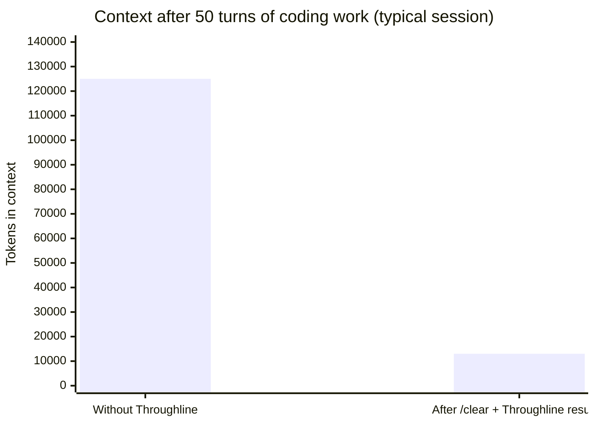
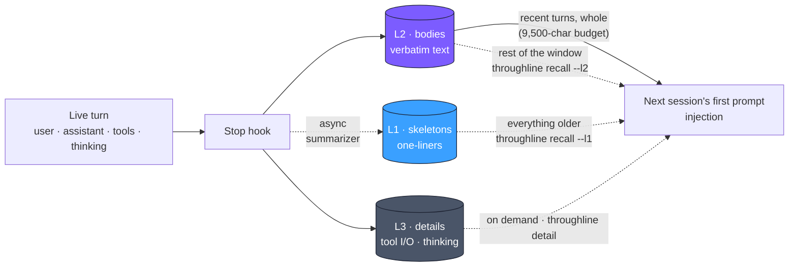
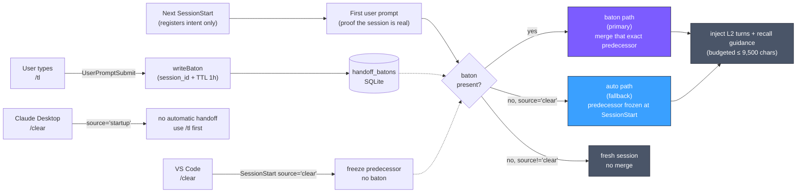

<p align="center">
  
  <br>
  <sub><em>This image represents continuity that preserves relationships, direction, and memory even as environments and boundaries change.</em></sub>
</p>

# Throughline

[](https://www.npmjs.com/package/throughline)
[](LICENSE)
[](https://nodejs.org)
[](https://github.com/kitepon/Throughline/actions/workflows/test.yml)

**English** · [日本語](README.ja.md)

> **Cut ~90% of Claude Code's context usage while keeping nearly all the memory.**
> Throughline separates conversation by **type, not time** — humans-readable text stays, machine-generated tool output retires to SQLite. Same decisions, same context, 90% lighter.

Built and maintained by [Quo](https://x.com/QLyun35332) at [kitepon.dev](https://kitepon.dev/en).

## Ownership boundary

This repository owns installation, configuration, state, schema and migrations,
diagnostics, recovery, updates, and release decisions. Throughline works on its
own through the documented CLI and does not require a factory controller.
[dotagents](https://github.com/kitepon/dotagents) may wire Throughline into the
kitepon.dev development factory, but it integrates the product rather than
owning its state or controlling its lifecycle.
MarkItDown is a separately managed third-party CLI.

## In 30 seconds

```bash
npm install -g throughline
throughline install     # registers hooks/skills and provisions the VS Code monitor task
```

That's it. Open any Claude Code session and your turns flow into
`~/.throughline/throughline.db` automatically. In VS Code, `/clear` resumes
through the `SessionStart source='clear'` auto path. Claude Desktop does not
emit that source, so type `/tl` before `/clear` there. Use `/tl` before any
other boundary, such as a brand-new chat or a VS Code restart, when you want
to name the predecessor exactly.

Grok Desktop is also a first-class host. `throughline install` writes
`~/.grok/hooks/throughline.json`. On Grok, `/tl` does not inject into the
current window — it starts a new Terminal seat. See below.

Cursor is also a first-class host. `throughline install` upserts
`sessionStart` / `beforeSubmitPrompt` / `stop` into `~/.cursor/hooks.json` and
leaves factory hooks in place. Capture reads Cursor `agent-transcripts` jsonl.
Handoff injection uses `sessionStart` `additional_context`. `/tl` does not
auto-launch a successor Cursor chat — the next new conversation drinks the
baton. See [ADR 0022](docs/adr/0022-cursor-host-capture.md).

<details>
<summary><b>Also using Codex?</b> Global install registers Codex hooks too — click for details.</summary>

Global install also registers Codex `UserPromptSubmit`, `PostToolUse`, and
`Stop` hooks in `~/.codex/hooks.json` and enables both
`[features].codex_hooks = true` and `[features].hooks = true` in
`~/.codex/config.toml`. The Codex hooks invoke the installed
`bin/throughline.mjs` through an absolute Node path, so Codex App Server PATH
differences do not hide the command. They are registered synchronously
(`async: false`), matching the Codex hook behavior verified in Caveat. Existing
non-Throughline Codex hooks are preserved. The prompt and tool-loop hooks capture
rollout memory and write monitor state, but they do not inject `$throughline` at
usage thresholds; token-monitor is display-only and is never an auto-refresh
trigger. It also installs a global `$throughline` Codex skill. Bare
`$throughline` starts a new Codex thread through app-server, injects Throughline
DB handoff memory as a developer item, and opens that thread in the selected
host; ask explicitly for current-thread rollback diagnostics when you want the
guarded `trim --execute --host codex` surface.

フック登録後の承認とWindowsでの起動条件は、[Codexの診断と復旧](#codex-windows)を参照。

</details>

<details>
<summary><b>Also using Grok?</b> Global install registers Grok hooks — click for details.</summary>

Global install writes `~/.grok/hooks/throughline.json` with absolute `node` +
installed `bin/throughline.mjs` for SessionStart, UserPromptSubmit, and Stop.
Do not register a bare `throughline` command: Grok Desktop's GUI PATH will not
see it.

Turns are stored as `grok:<sessionId>`. L2 is recovered from
`~/.grok/sessions/<encodeURIComponent(cwd)>/<id>/chat_history.jsonl`.
Grok does not feed UserPromptSubmit stdout or a rewritten `chat_history.jsonl`
into the live model prompt.

After `/tl` on a Grok session whose `handoff-context` is `ready`, Throughline
writes the baton and then runs:

```bash
throughline grok-continue --session grok:<id>
```

cwd is the source session's `project_path`, not the caller's cwd. The first
user text is preamble + the handoff-context body + continue + wait. Missing
context or project_path does not spawn. Claude `/tl`, Codex `/tl`, and Grok
`/clear` do not launch this CLI. Do not use aiterm, `--rules`, or `--from`.
macOS Terminal only.

The new seat is a top-level directory under
`~/.grok/sessions/<encodeURIComponent(cwd)>/`. Desktop Inactive folding is
not the success condition. A source with no L2 (including a `merged_into`
chain member with zero bodies) does not spawn — open a fresh chat, exchange
one or two turns, then `/tl`.

</details>

## How it compares

| | **Throughline** | `/clear` (built-in) | `/compact` (built-in) | MemGPT / SummaryBufferMemory |
|---|---|---|---|---|
| **What it does** | retire tool I/O to SQLite, keep text in-context | wipe the whole window | LLM-summarize the whole window | recency-based summarize |
| **Compression axis** | content **type** (text vs tool I/O) | none — full wipe | **recency** (uniform) | **recency** (uniform) |
| **Memory after the boundary** | ✅ recent turns verbatim (whole, budget-packed) + everything older via `recall` pull + L3 on demand | ❌ zero | △ lossy single summary | △ lossy summary |
| **Tool I/O handling** | retired to L3, retrievable by `/sc-detail HH:MM:SS` | gone | folded into summary, unreadable | folded into summary |
| **Coding-assistant fit** | high — tool I/O is the heavy 80% | low — you lose the thread | medium — but irreversible | medium |
| **Auto-inheritance risk** | low (`/tl` names the predecessor; VS Code `/clear` freezes one transcript-backed candidate) | n/a | n/a | high |
| **Runtime deps** | **zero** (Node 22.13+ built-in `node:sqlite`) | n/a | n/a | many |
| **Multi-session token monitor** | ✅ real `message.usage` / Codex rollout `token_count` | — | — | — |

**Short version**: `/clear` throws everything away, `/compact` blurs everything together, Throughline keeps the *text* you wrote verbatim and only retires the *tool output* — which is where 80% of the bloat lives.

<details>
<summary><b>Why this matters — the 80% tool-I/O problem</b></summary>

In a typical Claude Code session, **80% of the context window is tool I/O** —
file reads, Bash output, grep results. This data is consumed the moment Claude
acts on it, but it stays in the context forever, pushing you toward the window
limit.



```
Without Throughline (50 turns, no /clear):
  user/assistant text  ~25,000 tok  ████
  tool I/O (80%)      ~100,000 tok  ████████████████
                       ≈ 125,000 tok total

With Throughline (50 turns → /clear → resume):
  resume injection      ~3,000 tok  ▌  (recent L2 turns, whole, ≤ 9,500 chars)
  older memory          0–10,000 tok   (pulled only when needed: recall --l2 / --l1)
  tool I/O                  0 tok      (retired to SQLite, on-demand via detail)
                       ≈ 13,000 tok worst case — 90% lighter
```

Throughline separates conversation content by **type, not time**: human-readable
conversation stays in-context, machine-generated tool output retires to L3.
Unlike MemGPT or LangChain's SummaryBufferMemory which compress by **recency**
(old = summarized), this is purpose-built for coding assistants where tool I/O
is heavy but transient.

The retired L3 data isn't lost — Claude can pull it back on demand via
`throughline detail <time>` when a past turn's tool output becomes relevant
again.

Throughline also ships a multi-session **token monitor** that reads real
Anthropic API usage from the transcript JSONL (no `length / 4` heuristics).

</details>

---

## Three-layer memory model (schema v9)



| Layer | Name       | Where it lives        | Content                                                               | Cost per turn |
| ----- | ---------- | --------------------- | --------------------------------------------------------------------- | ------------- |
| **L1** | Skeleton  | pulled on demand (`recall --l1`) | one-line summary of the turn (default backend: Codex CLI `gpt-5.6-luna`, fallbacks per ADR 0015) | ~10 tok       |
| **L2** | Body      | injected while the budget lasts; rest via `recall --l2` | user text + assistant reply, verbatim                                 | full natural  |
| **L3** | Detail    | SQLite only           | tool I/O, system messages, images, **extended thinking** (on-demand)  | heavy, retired |

The layers are **complementary and disjoint** — nothing is duplicated across
them. Extended thinking blocks are stored at L3 (`kind='thinking'`) so the
next session can see *what the previous Claude was thinking* at the moment it
was interrupted, not just what it said aloud. Thinking is never injected —
it stays retrievable via `throughline detail <time>`.

At the **first user prompt** of the next session (two-phase handoff, ADR
0014), Throughline rebuilds the context from SQLite and injects it as plain
text (push/pull design, ADR 0016):

- The **most recent turns** are injected as full L2 (`bodies`) text — packed
  whole-turn, newest-first, as many as fit the ~9,500-char budget
- **L1 (`skeletons`) one-liners are not injected** — a guidance section with
  ready-to-run `throughline recall --l2|--l1` commands is injected instead,
  so older memory is pulled only when needed
- L3 stays in SQLite and is retrieved on demand via `/sc-detail <time>`

L1 summaries are generated lazily: for sessions that stay under 20 turns, no
external summarizer is invoked. Summaries target a **compression ratio**
(default 1/5 of the source turn, configurable via `THROUGHLINE_L1_RATIO`;
invalid values are an explicit error, not a silent default). In the
Claude-primary path the backend order is: **Codex CLI** (default
`gpt-5.6-luna` at reasoning effort `low`, chosen by measured evaluation —
see ADR 0015; override via `THROUGHLINE_L1_MODEL` / `THROUGHLINE_L1_EFFORT`)
→ **Claude Haiku 4.5** via a subprocess (`claude -p`), reusing your Claude
Max login — no API key required. Each attempted backend records its result.
For Codex-primary capture, the L1 backend is the Codex CLI only; failures are
explicit and do not fall back to Claude Haiku or raw L2.

All three layers (L1/L2/L3) have working write paths as of schema v5.
`/sc-detail HH:MM:SS` returns user/assistant text (L2) plus a kind-grouped view
of tool inputs, tool outputs, and hook output captured at L3 for that turn.

---

## Inheritance: `/tl` writes a baton; VS Code `/clear` uses `source='clear'`

Throughline supports two inheritance paths. A `/tl` baton names one predecessor
exactly. If no eligible baton exists, the VS Code `/clear` path can use the
`SessionStart source='clear'` signal to freeze one transcript-backed predecessor.
The baton is checked first.



### baton path: `/tl` → deterministic inheritance

When the user types `/tl`, the `UserPromptSubmit` hook writes a handoff baton
with **that session's `session_id`** into the
`handoff_batons` table. The next new session consumes the baton **at its
first user prompt** (eligibility: the session must have been born within the
1-hour TTL after the baton was written) and merges that exact predecessor's
memory, regardless of the `source` value.

Why the first prompt and not `SessionStart` itself: Claude Code can fire
multiple `SessionStart` hooks for the same project within a few hundred
milliseconds, and some of them never materialize into a real session (no
transcript is ever written). At `SessionStart` time a real session and such a
"ghost" are indistinguishable — even a real session's transcript file appears
only ~0.5s **after** the hook fires. A ghost that consumed the baton first
would silently swallow the predecessor's memory while the real session
started empty. Deferring consumption to the first user prompt closes this:
a ghost never submits a prompt, so it can never take the baton (ADR 0014).

This path is deterministic: it names the predecessor by id rather than
guessing, so it is the explicit path for multi-window work and for hosts that
do not emit `source='clear'`.

```
/tl: Session A → /tl → (/clear, new chat, or restart) → Session B (consumes A's baton)
```

### auto path: VS Code `source='clear'` → frozen predecessor

The built-in `/clear` command does **not** reach `UserPromptSubmit` on the
tested Claude Code clients. VS Code instead sends `SessionStart source='clear'`.
When no baton is present, Throughline resolves the most recent unmerged session
for the same project **at `SessionStart` time** (freezing that choice, and
skipping candidates that have no transcript — i.e. ghosts) and performs the
merge + injection at the session's first user prompt.

Set `THROUGHLINE_DISABLE_AUTO_HANDOFF=1` in your environment to opt out of
this path. The env var does not disable explicit `/tl` batons.

Claude Desktop neither forwards built-in `/clear` to `UserPromptSubmit` nor
emits `SessionStart source='clear'`; use `/tl` before `/clear` there. The
cross-client measurements and upstream report are recorded in the archived
[`docs/12_desktop_clear_handoff_plan.md`](docs/archive/12_desktop_clear_handoff_plan.md).

### What gets injected

Both paths inject the **same** curated memory (push/pull design, ADR 0016):

- A **"現在地 (latest exchange)"** anchor (added in v0.4.12) re-surfaces the
  most recent user directive and the most recent assistant turn directly under
  the header, each truncated to 600 characters
- A **pull guidance section** (always present) with ready-to-run
  `throughline recall` commands — session id, an ISO-ms boundary, and turn
  counts are baked in at injection time
- L2 verbatim: as many of the most recent turns as fit the ~9,500-char
  injection budget, packed whole-turn (typically 7–8 turns; more for light
  conversations). **L1 summaries are not injected** — the rest of the
  20-turn window is retrieved verbatim via `throughline recall --l2`, and
  everything older via `throughline recall --l1` (summarized turns show
  their L1 line; unsummarized ones are listed explicitly with a
  `throughline detail` pointer)
- L3 references (`throughline detail <time>` retrieval commands, attached
  inline to each L2 row; bodies stay in SQLite)

The injection is reframed as **"resuming an interrupted task"** rather than
"reading past logs". The L2 verbatim already contains the last assistant
turn — what Claude was about to do next — so no separate memo or extended
thinking section is injected. The current-state anchor exists because, on
long L2 windows, attention can fixate on the *first* L2 entry (the oldest
turn in the window) and misread an old plan discussion as the current task;
pinning the latest exchange at the top of the injection prevents that drift.

Each merged row keeps its `origin_session_id`, so repeated handoffs
accumulate memory through chains:

```text
VS Code:
S1 (4 turns) --/clear--> S2 (auto-merges S1, adds 3 turns) --/clear--> S3 (auto-merges S2, adds 5 turns)
                         origin=S1×4                                   origin=S1×4, S2×3, S3×5
```

---

<details>
<summary><b>Codex trim</b> — operator-level details (click to expand)</summary>

## Codex trim

Codex support projects the same `HandoffRecord` into a `throughline_handoff` JSON block.
Claude hooks, slash commands, transcript parsing, and `/tl` baton handoff remain available.

Useful inspection commands:

```bash
throughline handoff-preview --session <id>
throughline codex-summarize --session codex:<thread-id> --json
throughline codex-resume --session codex:<thread-id>
throughline codex-resume --session codex:<thread-id> --format handoff
throughline codex-handoff-start --session codex:<thread-id>
throughline codex-handoff-start --session codex:<thread-id> --execute --open-host desktop
throughline codex-handoff-smoke --session codex:<thread-id>
throughline codex-handoff-model-smoke --session codex:<thread-id> --dry-run --json
THROUGHLINE_EXPERIMENTAL_CODEX_HANDOFF_MODEL_SMOKE=1 \
  throughline codex-handoff-model-smoke --session codex:<thread-id> --json
throughline codex-resume --session codex:<thread-id> --format item-json
printf '**Next move**: continue the Codex implementation\n' \
  | throughline codex-resume --session codex:<thread-id> --memo-stdin
printf '**Next move**: continue the Codex implementation\n' \
  | THROUGHLINE_EXPERIMENTAL_CODEX_MODEL_VISIBLE_SMOKE=1 \
      throughline codex-visibility-smoke --session codex:<thread-id> --memo-stdin \
        --request-timeout-ms 150000 --json
THROUGHLINE_EXPERIMENTAL_CODEX_MODEL_VISIBLE_SMOKE=1 \
  throughline codex-visibility-smoke --session codex:<thread-id> \
    --resume-after-inject --request-timeout-ms 180000 --json
throughline codex-threads --limit 5
```

The L2→L1 summarizer uses Codex CLI for Claude-primary capture, then Claude Haiku if Codex CLI fails.
Codex-primary capture uses Codex CLI only and reports its failures.

**Codex current-thread rollback / inject is explicit-only.** The 2026-05-06
incident initially looked like a rolled-back user prompt could reappear after
VS Code restart / reconnect, and later live experiments showed token usage can
drop briefly and then return in the same thread. For that reason, Codex hooks do
not perform automatic current-thread refresh. `throughline trim --execute --host
codex` remains available as an explicit diagnostic current-thread path when
injectable DB memory is available. Bare `$throughline` instead starts a new
thread with the handoff prompt, matching the safer Claude-style handoff model.

`throughline codex-host-primitive-audit` can inspect the installed Codex
app-server schema read-only. On the current tested Codex CLI, it finds
`thread/rollback`, `thread/inject_items`, and new-thread primitives, but no
current-thread primitive that either clears/rewrites retained rollback sources
or isolates/projects them away from model-visible input. This is now diagnostic
evidence only, not an execute blocker. The audit also emits a host-agnostic same-thread repair contract:
a passing design needs a current-thread non-resurrection primitive, rollback
non-resurrection guarantee, memory reinjection, post-repair read verification,
and a restart / reconnect non-resurrection smoke. VS Code evidence can inform
that contract, but it is not itself the repair primitive.

Dry-run and preflight also inspect planned rollback risk. If the user text that
would be removed is already present in Codex `compacted.replacement_history`,
Throughline reports `Planned rollback restore safety: risk` as diagnostic
context, but it no longer refuses preflight or execute on that basis.

The intended memory contract remains:
older turns come back as L1 summaries, the latest 20 turns come back as full L2
conversation bodies, and L3 remains detail references instead of inline tool
payloads. Throughline never guesses the active Codex thread: use
`throughline codex-threads` to inspect read-only rollout candidates, then pass
the chosen id explicitly. If a wrapper or host exports
`THROUGHLINE_CODEX_THREAD_ID` or `CODEX_THREAD_ID`, `throughline trim --host
codex` treats that as a current-thread identity signal; the CLI flag still wins
when both are present. Throughline does not fall back to "latest rollout"
guessing. When the chosen Codex thread has a current-project rollout,
`throughline trim` can use the rollout as the trim source even if the
Throughline DB has no captured Codex turn bodies; rollback events in the rollout
are applied before the rollback plan is built. When DB memory exists, the
injected memory is built from the Throughline DB rather than from the rollout
preview; guarded execute refuses instead of injecting a rollout preview when
Throughline DB memory is absent. During Codex
preflight, Throughline also compares the rollout active-turn count with
app-server `thread/read` / `thread/resume` counts. The separate read-only
`codex-restore-smoke` also checks paginated `thread/turns/list` counts across
fresh app-server processes. These are live app-server guards only; they are not
by themselves a durable restart-safe proof. The guarded
execute path is enabled by explicit `--execute`; it may still report
`execute-sent-live-only` or `execute-unverified` if durable rollout evidence is
not observed. Throughline reports `execute-durable-verified` when the rollout
records a new rollback marker and records the injected active-work memory.
Developer memory injection is item-level on current Codex hosts and may not add a
host-visible turn during the immediate post-inject read; Throughline therefore
uses the `thread/inject_items` response shape to decide whether a turn-count
increase should be expected.
`doctor --codex` also reports this context-refresh readiness explicitly:
rollback source, inject memory source, the L1/L2/L3 memory contract, current
L1/L2/L3 counts, the heuristic reduction estimate when rollout text is
available, and the host primitive audit status as diagnostic context. L3 is
reported as references-only; L3 bodies and tool payloads are not injected.

Codex trim dry-run reports a context reduction estimate when rollout text is
available: rollback-candidate estimated tokens, injected-memory estimated
tokens, and net estimated reduction. This is a `chars / 4` heuristic from the
rollout text, not an exact host tokenizer measurement. If rollback candidate
turns are `0`, there is no current trim saving under the active keep-recent
setting.

Claude-side rewind UI itself is not driven by Throughline. In VS Code, the
auto-handoff flow is `/clear` → new session → automatic injection of curated
memory at the session's first user prompt. Claude Desktop requires `/tl`
before `/clear`.
Throughline does not invoke `/rewind` or any Claude Code internal command.

Codex-primary setup has an installed Stop hook after global
`throughline install`. In real sessions, verify capture rather than assuming it:
`doctor --codex` compares the current Codex thread with the latest captured DB
session, and makes any missing Throughline DB advance visible. A Codex VSCode
session that was already open before hook shape changes may not be a clean
natural Stop smoke; use a newly started session or `codex exec` smoke for that
check. A newly started VSCode-origin Codex session has been verified with
matching `current Codex thread` and `latest DB session` in `doctor --codex`.
The following commands are the explicit diagnostic, resume, smoke, and
guarded trim surfaces:

```bash
throughline doctor --trim --host claude
throughline doctor --trim --host codex
throughline doctor --codex
throughline codex-capture --codex-thread-id <id> --json
throughline codex-summarize --session codex:<id> --json
throughline codex-resume --session codex:<id> --format handoff
throughline codex-handoff-start --session codex:<id>
throughline codex-handoff-start --session codex:<id> --print-prompt
throughline codex-handoff-smoke --session codex:<id> --json
throughline codex-handoff-model-smoke --session codex:<id> --dry-run --json
# optional model smoke; uses codex exec --ephemeral --sandbox read-only:
# THROUGHLINE_EXPERIMENTAL_CODEX_HANDOFF_MODEL_SMOKE=1 throughline codex-handoff-model-smoke --session codex:<id> --json
printf '**Next move**: continue the current Codex task\n' \
  | throughline codex-resume --session codex:<id> --memo-stdin
printf '**Next move**: continue the current implementation\n' \
  | throughline trim --dry-run --host claude --memo-stdin
throughline codex-threads --json --limit 5
throughline trim --dry-run --host codex --codex-thread-id <id>
throughline trim --dry-run --host codex --codex-thread-id <id> --preview-max-chars 4000
throughline trim --preflight --host codex --codex-thread-id <id>
CODEX_THREAD_ID=<id> throughline trim --preflight --host codex
throughline trim --execute --host codex --all
# read-only app-server process restart smoke; not full VS Code restart-safe proof:
# THROUGHLINE_EXPERIMENTAL_CODEX_RESTORE_SMOKE=1 throughline codex-restore-smoke --codex-thread-id <id> --json
# read-only local restore source inventory; not full VS Code restart-safe proof:
# throughline codex-restore-source-audit --codex-thread-id <id> --json
# manual two-phase VS Code reload/reconnect smoke:
# THROUGHLINE_EXPERIMENTAL_CODEX_VSCODE_RESTORE_SMOKE=1 throughline codex-vscode-restore-smoke --prepare --codex-thread-id <id> --json
# after reloading/reconnecting VS Code and sending the printed prompt:
# throughline codex-vscode-restore-smoke --verify --codex-thread-id <id> --marker <marker> --prepared-at <iso> --after-vscode-restart --json
# explicit current-thread trim:
throughline trim --execute --host codex --all --codex-thread-id <id>
```

For Codex trim, the default memory session is the current Codex thread:
`codex:<CODEX_THREAD_ID>` / `codex:<THROUGHLINE_CODEX_THREAD_ID>`. Throughline
does not fall back to the latest project session for Codex injection, because
that can mix Claude-side memory into a Codex rollback. Pass `--session` only
when deliberately injecting a different captured session.

That current-work framing matters: the original `/tl` design learned that L1/L2
memory alone can read like past logs rather than "the work in progress". The
memo is one strong signal, but the broader mechanism is explicit structure:
recent L2 is labeled as an active work thread, older hypotheses may be
superseded by later entries, and the continuation instruction appears at the
top and bottom of the injected memory.

For Codex-primary sessions, `throughline codex-capture --codex-thread-id <id>`
stores active rollout turns under `codex:<thread_id>`, and `throughline
codex-summarize --session codex:<thread_id>` can write older captured L2 turns
to L1 with the Codex CLI backend. `throughline codex-resume --session
codex:<thread_id>` renders that memory as an active-work context. `--format
handoff` renders a shorter prompt for starting a new Codex thread without
mutating the old one; it caps recent L2 entries, long body text, and detail
references while pointing back to the full `codex-resume` context. `--format
item-json` returns a Codex developer-message item for hosts that accept
structured item injection; it is a rendering surface only and does not mutate
the Codex thread by itself. `--memo-stdin` prepends an explicit Codex-primary
current-work memo to that rendered context; this is a Codex-side opt-in for
"what was I about to do next" signal, independent from the Claude `/tl` baton.
`throughline codex-visibility-smoke` is the experimental mutation check for
that rendered memory: it injects the active-work developer message and starts a
marker-check model turn through the Codex app-server, so it requires the
`THROUGHLINE_EXPERIMENTAL_CODEX_MODEL_VISIBLE_SMOKE=1` opt-in. In local real-host
smoke testing, the marker appeared in `item/agentMessage/delta`; use
`--resume-after-inject` to verify injected memory still survives a second
`thread/resume` before `turn/start`, and use `--request-timeout-ms` /
`--timeout-ms` when the model turn may take longer than the default wait.
`throughline codex-restore-smoke` is the read-only restart diagnostic for the
same boundary: it starts fresh Codex app-server processes and compares
`thread/read` / `thread/resume` / paginated `thread/turns/list` turn counts with
the rollout active turn count. Its proof scope is
`app_server_process_restart_only`; even a passing result is not VS Code
restart-safe proof for rollback / inject. With `--inspect-risky-rollout`, it can
inspect a risky rollout read-only; if retained rollback text appears in
app-server responses, the status becomes `app-server-restore-text-retained`
when it appears in blocking candidates such as direct turn text or
`replacement_history`, or `app-server-restore-text-quoted` when it appears only
inside quoted/tool-output fields such as `aggregatedOutput`. The text-match
report includes sample JSON paths, location kinds, risk classes, and
`blocking-candidates` so quoted old output is not confused with resurrected user
message fields.
`throughline codex-restore-source-audit` is the local inventory companion: it
checks the Codex rollout, `session_index.jsonl`, `state_*.sqlite`, and VS Code
globalStorage / workspaceStorage candidates, VS Code `settings.json`, and VS
Code logs for the chosen thread id and retained rollback text. SQLite-backed VS
Code storage candidates such as `.vscdb`, `.sqlite`, `.sqlite3`, and `.db` are
opened read-only and summarized by table / column / needle matches. It also
scans installed OpenAI/Codex VS Code extension bundles for restore-path signals
such as `thread/read`, `thread/resume`, `thread/turns/list`, reconnect
`needs_resume`, persisted webview atoms, follow-up queue signals, and explicit
rollback non-resurrection projection candidates such as `replacement_history`
filter / tombstone paths. A match here is static evidence only; current tested storage roots can still report
`VS Code storage matches: 0` for the selected thread and retained rollback text.
VS Code log matches are also classified into thread-id hits, retained rollback
text hits, patch-apply failures, thread stream broadcasts, and
`replacement_history` signals so incidental log mentions can be separated from
restore-path evidence.
Its proof scope is `local_restore_source_inventory_only`; it can narrow the
restore-source hypothesis, but it still does not prove VS Code restart safety.
These VS Code scans are diagnostics only. The product repair path remains the
host-agnostic same-thread contract reported by `codex-host-primitive-audit`, not
a VS Code-only implementation path.
`throughline codex-vscode-restore-smoke` is the manual full-boundary protocol:
`--prepare` injects a hidden active-work developer-memory marker, then VS Code
must be reloaded or reconnected and asked a prompt that does not contain the
marker. `--verify` scans the rollout for a marker answer after the prepare
timestamp and rejects the proof if the marker leaked through the user prompt.
Only a marker-free smoke prompt followed by an assistant answer whose trimmed
text exactly equals the marker, plus `--after-vscode-restart`, is treated as
`restartSafe: true`; prepare remains an explicit experiment gated by
`THROUGHLINE_EXPERIMENTAL_CODEX_VSCODE_RESTORE_SMOKE=1`. A real VS Code
reload/reconnect run has passed this marker proof, showing hidden developer
memory can remain model-visible after reconnect. That is not the same as
proving rollback-targeted user turns cannot resurrect, so rollback-specific
smokes remain the stronger diagnostic boundary.
`throughline codex-vscode-rollback-smoke --verify --after-vscode-restart` is
the read-only verifier for that next proof: it requires a rollback event,
rolled-back user text, a later user turn, and `restoreSafety: ok` before it
will report `restartSafe: true`.
`throughline codex-rollback-model-visible-smoke` is a stricter controlled
experiment for the current thread: `--prepare` creates a unique user marker and
rolls that turn back, while `--verify` later starts a model turn that contains
only the marker prefix, not the full marker. It reports `reproduced` only if the
model returns the hidden full marker. This mutates the thread and is gated by
`THROUGHLINE_EXPERIMENTAL_CODEX_ROLLBACK_MODEL_VISIBLE_SMOKE=1`. Use
`--marker-file <path>` for live runs so the full marker is stored locally instead
of being printed into the same conversation being tested. Verify output reports
`rolledBackMarkerModelVisible` separately from `restartSafe`. In a controlled
2026-05-08 current-thread run, both the immediate fresh app-server verify and
the post VS Code reload/reconnect verify returned `not-reproduced` with no full
marker in the prompt or observed assistant output.

A 2026-05-07 incident-shaped live rollback run produced useful risk evidence:
`thread_rolled_back` and injected active-work memory were recorded in the
rollout, but rollback-targeted user text remained in
`compacted.replacement_history`, and the verifier later observed rolled-back
user text reappearing in rollout/app-server diagnostics (`restoreSafety:
risk`). A later risky restore inspection found those retained matches only
inside `aggregatedOutput`, so this is not yet proof that the text is sent as a
fresh user message or model-visible input. Because the controlled reproduction
smoke stayed clean across app-server restart and VS Code reload/reconnect,
Throughline no longer blocks Codex trim solely on this diagnostic risk.

For Codex, fresh-thread handoff remains an explicit continuation path in trim
plans and trim diagnostics, but it is not a replacement for current-thread
trim. The guided entrypoint is
`throughline codex-handoff-start --session codex:<thread-id>`; it shows the
structural smoke, model-smoke dry-run boundary, handoff render command, optional
live model smoke, and can include the prompt with `--print-prompt`. With
`--memo-stdin`, it also propagates `--memo-stdin` into the replay commands and
reminds you to pipe the same memo when using them separately. Add `--execute`
to create a new Codex app-server thread, inject the handoff memory as a
developer item, and open it with `--open-host auto|desktop|vscode|cli|none`. `auto`
opens the new task in Codex Desktop when invoked there, while preserving the
existing VS Code and CLI routes. The result reports both the requested and
resolved host. The installed `$throughline` skill passes the current Codex
surface explicitly so a persistent shell or PTY cannot redirect the handoff.
WindowsのDesktop引き継ぎは、稼働中のCodex Desktopが使う実行ファイルを選びます。
PATH上の別バージョンによる設定読取りエラーを避け、選んだ実行元を結果へ表示します。
Desktopを起動してから実行してください。実行ファイルが見つからない場合や、異なる実行ファイルの
Desktopが複数稼働している場合は理由を出して停止します。明示した`--codex-app-server-bin`は優先します。
The
individual commands remain available: validate the fresh-thread handoff with
`throughline codex-handoff-smoke --session codex:<thread-id>`, optionally audit
the model-smoke boundary with
`throughline codex-handoff-model-smoke --session codex:<thread-id> --dry-run --json`,
render it with `throughline codex-resume --session codex:<thread-id> --format handoff`,
then start a new Codex thread with that context. This does not mutate the current
thread. `trim --execute --host codex` is the current-thread mutation path and
still requires explicit execution, injectable Throughline DB memory, and
explicit Codex thread identity.
Human-readable dry-run output truncates the inline memory preview for scanability;
the full text remains in `--json` as `memoryPreview.text`, and for Codex the
fresh-thread continuation can be guided with `codex-handoff-start` or rendered
directly with the `codex-resume` command shown in the fresh-thread continuation path.

</details>

---

## Multi-session token monitor

Run:

```bash
throughline monitor            # all active sessions in the current project
throughline monitor --all      # every project, every session
throughline monitor --session <id-prefix>
```

Example output:

```
[Throughline] 1 セッション
▶ Throughline       Claude 2ed5039c just now ██░░░░░░░░  205.1k /   1.0M  claude-opus-4-6
  Throughline       Codex  019e085c just now ██████░░░░  151.9k / 258.4k  gpt-5.5
```

- **Claude token counts are accurate.** Read straight from the latest
  `message.usage` field in the session transcript JSONL, which is what
  Anthropic's API actually reported
  (`input_tokens + cache_creation_input_tokens + cache_read_input_tokens`).
  No `length / 4` approximation.
- **Codex token counts use the rollout `token_count` event when present.** The
  monitor discovers live Codex rollouts directly from
  `~/.codex/sessions/**/rollout-*.jsonl`, so a current Codex session can appear
  even before the Codex Stop hook writes `codex:<thread_id>` monitor state.
  While the monitor is running it reads the live rollout every tick and prefers
  the latest verified `token_count` sample. During an open Codex turn, the
  monitor overlays transient `output_tokens` on top of `input_tokens`; when
  `task_complete` arrives it drops back to verified `input_tokens` only. If a
  Codex rollout has no token-count event, Throughline can show an explicit
  estimate with `estimated: true` and the monitor marks it with `est`; it is not
  presented as exact usage.
- **Codex auto-refresh is disabled.** The Codex `UserPromptSubmit` and
  `PostToolUse` hooks capture rollout memory and write monitor state, but they
  do not inject `$throughline` instructions. The Codex Stop hook also captures
  DB memory, writes monitor state, and stays quiet instead of sending rollback +
  injection above a threshold.
- **1M-context detection** is automatic. It checks the `[1m]` suffix in the
  transcript, falls back to string matching on `1M context`, and finally
  promotes to 1M if observed usage exceeds 200k.
- **Multi-session view.** Each Claude Code or Codex session writes its own
  state file (`~/.throughline/state/<session_id>.json`), and active Codex
  rollouts are discovered directly from the Codex session directory. Codex
  session ids are stored as `codex:<thread_id>` in JSON state, while the display
  shows the raw first 8 thread-id characters (for example `019e085c`) to avoid
  the ambiguous `codex:01` prefix slice. The monitor scans every second and
  displays one row per live session, sorted by last activity. The most recent
  one is highlighted with `▶`.
- **Stale hiding.** Sessions that haven't been touched in 15 minutes drop out of
  the default view; files older than 24 hours are deleted entirely. This is the
  only time threshold in the system and is used solely for display hygiene — no
  memory decisions are made from it.
- **Line-wrap safe.** Each line is truncated to `process.stdout.columns - 1`
  before drawing, preserving ANSI color codes. The redraw cursor math cannot
  desync on narrow terminals.
- **Resize resilient via OSC 18t.** Windows ConPTY + VS Code task terminals
  freeze `process.stdout.columns` at the PTY's initial size and never
  propagate panel resizes into Node, so polling or `resize` events can't
  catch them. Throughline queries the terminal itself with the CSI `18 t`
  escape (`\x1b[18t`) every tick, parses the `\x1b[8;rows;cols t` reply off
  stdin in raw mode, and uses the real current width for truncation. On
  terminals that don't answer the query, the renderer falls back to
  `process.stdout.columns → env.COLUMNS → 80`. When the width changes the
  viewport is cleared in full (`\x1b[2J\x1b[3J\x1b[H`) before the next
  frame so the previous, wrongly-sized frame can't stack beneath it.
- **Per-row "last updated" stamp.** Each session row carries an 8-cell
  `just now` / `24m ago` stamp right after the session id, placed before the
  bar so narrow terminals don't truncate it. It follows the newest state,
  transcript, or Codex rollout mtime, so active sessions stay visible and the
  stamp can move before the next Stop hook completes. When you need more detail,
  `throughline doctor --session <id-prefix>` compares the state file against
  the actual transcript JSONL and flags drift, idle time, and
  `/clear`-induced transcript path staleness.
- **Live usage first, state snapshot as fallback.** When the Stop hook finishes
  a turn it persists the latest `tokens / model / contextWindowSize` back into
  the state file. The monitor now prefers live Claude transcript / Codex rollout
  reads and uses the snapshot only when the live file cannot provide usage, so
  the display no longer waits for Stop to update.
- **Host-aware state.** Missing `host` means an older Claude state file.
  Codex states use `host: "codex"`, keep `transcriptPath: null`, and store the
  Codex rollout path separately as `rolloutPath` so the Claude transcript parser
  is never pointed at a Codex rollout.
- **Non-blocking Claude Stop hook (v0.3.22+).** The Claude Stop hook is registered with
  `"async": true` so `throughline process-turn` runs in the background and
  does not delay Claude's reply from reaching you. L1 Haiku summarization
  (`claude -p` subprocess + inference, seconds to tens of seconds) would
  otherwise stall the user-facing response of every turn; since L1 is only
  needed for the *next* session's injection, there is no reason
  to block the current turn on it. Existing installs need
  `throughline uninstall && throughline install` to promote the flag (the
  dedup logic skips entries that match by command string).

### VS Code auto-start (automatic)

After `throughline install`, the current VS Code / Cursor / VSCodium project
gets `.vscode/tasks.json` provisioned immediately when VS Code environment
variables are present. Any other VS Code project you work in also gets the file
on the first session event. The file configures `runOn: folderOpen` so the
monitor appears in a dedicated terminal panel the next time you open that
folder.

**How it works.** `ensureMonitorTaskFile` is called from `throughline install`
and from **all three Claude hooks (SessionStart, UserPromptSubmit, Stop)**. Whichever
one fires first in your environment creates the file; the rest are idempotent
no-ops. Once per project it inspects `.vscode/tasks.json`:

- **No file yet** → creates one with a single `Throughline Monitor` task, and
  emits a one-time `<system-reminder>` to stdout so Claude tells you a
  **Developer: Reload Window** is needed to activate the `folderOpen` task once
  (v0.3.19+).
- **Plain JSON with other tasks** → appends the monitor task, preserves your
  existing entries, `version`, and indentation (same notice fires once).
- **JSONC (comments or trailing commas)** → does not touch the file. Prints a
  one-time notice to stderr asking you to paste the snippet below.
- **Already contains a Throughline Monitor task** → does nothing (idempotent;
  this is the common path on every subsequent turn; notice is silent).

For Codex-primary projects, hook stdout is not always surfaced in the chat.
`throughline doctor --codex` therefore reports the VS Code monitor task status,
its `runOn` value, and the same Reload Window note in a visible diagnostic.

The generated task uses `type: 'shell'` with the absolute path to Node and
`bin/throughline.mjs`. VS Code wraps shell tasks in a PTY (xterm.js) so the
monitor sees `isTTY=true`, real `columns`, and resize events. Windows `.cmd`
shims and missing PATH entries cannot break it because the command is already
an absolute Node binary path.

**Opt out:** set `THROUGHLINE_NO_VSCODE=1` in the environment used by Claude
Code. Delete `.vscode/tasks.json` (or just the monitor entry) if you want to
stop auto-start for a project that already has one.

**Manual snippet for JSONC tasks.json files.** If Throughline refused to edit
your `tasks.json` because it contains comments or trailing commas, add this
entry to the `tasks` array yourself:

```jsonc
{
  "label": "Throughline Monitor",
  "type": "shell",
  "command": "throughline monitor",
  "isBackground": true,
  "presentation": {
    "reveal": "always",
    "panel": "dedicated",
    "group": "throughline",
    "close": false,
    "echo": false,
    "focus": false,
    "showReuseMessage": false,
    "clear": true
  },
  "runOptions": { "runOn": "folderOpen" },
  "problemMatcher": []
}
```

---

## Commands

公開版は冒頭のnpmバッジ、開発中の版は `package.json`、版ごとの変更は [CHANGELOG.md](CHANGELOG.md) を参照。Throughline supports Claude Code, Codex,
Grok, and Cursor as documented host adapters. The versioned, read-only
`handoff-context` boundary opens only an existing database and leaves baton
state, session ownership, and memory rows unchanged. Factory diagnostics,
Observer, runtime-error, capture, and normal handoff behavior remain available
under the same explicit-failure and local-only contracts.

Normal handoffs announce inherited continuity once in the first response and
explicitly forbid repeating that line in later responses. A project-bound
launcher may pass `--disclosure silent` for an embedded product that keeps
continuity metadata out of its chat. A supplement may also set
`handoffDisclosure` to `silent`. Legacy Throughline disclosure lines
in assistant memory are omitted from the next handoff; user quotations and the
actual reply body remain intact.

| Command                                        | What it does                                                 |
| ---------------------------------------------- | ------------------------------------------------------------ |
| `throughline install`                          | Register Claude user hooks/slash commands, the global Codex UserPromptSubmit/PostToolUse/Stop hooks, the global `$throughline` Codex skill, `~/.grok/hooks/throughline.json`, and the current VS Code monitor task when applicable |
| `throughline install --project`                | Register Claude hooks/slash commands in this repo only       |
| `throughline self-update [--json]`             | Update the official npm package, verify that public PATH resolves to that new CLI/version, reapply product-owned integrations, migrate an existing database, and verify public diagnostics in one call |
| `throughline uninstall`                        | Remove Throughline-managed Claude hooks/slash commands, only the Throughline-managed Codex hook, and the `$throughline` Codex skill |

Versions before v0.10.5 do not contain `self-update`. Upgrade those versions
once with `npm install --global throughline@latest`, then run
`throughline self-update`. Later updates use `throughline self-update` alone.
| `throughline monitor [--all] [--session <id>]` | Run the multi-session token monitor                          |
| `throughline monitor --diag`                   | Dump TTY/columns/env diagnostics (for debugging monitor render bugs) |
| `throughline detail <time>`                    | Retrieve L2 body text and L3 tool I/O for a turn (see below) |
| `throughline recall --l2\|--l1 --session <id> --before <ISO> ...` | Pull older memory referenced by the injection's guidance section (read-only; the exact command is baked into each injection) |
| `throughline caveat-context --session <id> --project <root> --json` | Return three completed dialogue turns and available Thinking for Caveat, without tool logs; `--host claude\|codex --transcript <path>` checks freshness |
| `throughline observer-read --project <absolute-directory> --json` | Read one completed-turn Observer page through the JSON-only public boundary |
| `throughline observer-wait --project <absolute-directory> --after-cursor <opaque> [--timeout-seconds 3600] --json` | Wait up to 3600 seconds for a completed-turn Observer cursor change |
| `throughline doctor`                           | Check Node version, hook registration, DB writability, PATH  |
| `throughline doctor --session <id-prefix>`     | Diagnose a specific session — detect state/transcript drift, idle vs. stuck |
| `throughline doctor --trim --host claude\|codex` | Diagnose trim host boundaries, manual procedure, and Codex host primitive blockage |
| `throughline doctor --codex`                   | Diagnose Codex primary entry state, captured DB sessions, context-refresh memory contract, new-thread handoff readiness, safe continuation status, and host primitive audit |
| `throughline factory-diagnostics --json`       | Versioned read-only native factory readiness JSON for database schema/migration, connector hooks, and representative capture/restore/handoff; does not emit bodies, secrets, absolute paths, or raw state |
| `throughline migrate --json`                   | Migrate only an existing Throughline database to the current schema and emit a versioned bounded result; a missing database is not created, while future schemas and migration failures exit non-zero |
| `throughline runtime-errors enable --json`     | Enable product-owned local runtime error collection in Throughline's own config; default is disabled |
| `throughline runtime-errors disable --json`    | Disable product-owned local runtime error collection |
| `throughline runtime-errors snapshot --json`   | Read the bounded product-owned runtime error aggregate; this command performs no network I/O |
| `throughline runtime-errors diagnostics --json` | Read bounded collection/store status without exposing the state path or raw errors |
| `throughline runtime-errors ack <cursor> --json` | Explicitly acknowledge records through a monotonic cursor; unacknowledged records are never compacted |
| `throughline runtime-errors resolve <fingerprint> --json` | Explicitly resolve an aggregate; observing the same fingerprint again reopens it |
| `throughline runtime-errors reopen <fingerprint> --json` | Explicitly reopen a resolved aggregate without fabricating a new occurrence |
| `throughline runtime-errors compact --json`    | Remove only acknowledged, resolved aggregates after retention; open or unacknowledged records remain |
| `throughline handoff-preview --session <id>`   | Print a Codex-facing `throughline_handoff` JSON projection    |
| `throughline handoff-context (--session <id> \| --project <path>) --json` | Print the SessionStart inheritance context without moving memory rows. Project mode selects the newest captured session with dialogue, supports `--disclosure silent`, and returns `empty` when no dialogue exists. Session mode may add a project-bound supplement inside the same 9,500-character budget |
| `throughline latest-session --project <absolute-path> --json` | Read the latest session id strictly scoped to one project; opens the existing database read-only and returns `empty` when the project has no captured session |
| `throughline grok-continue --session <id>` | Spawn a person-facing Grok seat whose first user text is the handoff-context body. cwd is the source session `project_path`. Does not spawn without ready context. No `--rules`. macOS Terminal only |
| `throughline codex-capture --codex-thread-id <id>` | Capture active Codex rollout turns into a `codex:<thread_id>` DB session |
| `throughline codex-summarize --session codex:<id>` | Summarize captured Codex L2 into L1 with the Codex CLI backend |
| `throughline codex-resume --session codex:<id>` | Render Codex active-work context from a captured Codex session |
| `throughline codex-resume --session codex:<id> --format handoff` | Render a concise fresh-thread handoff prompt without mutating the current thread |
| `throughline codex-handoff-start --session codex:<id>` | Guided start plan for moving handoff memory into a new Codex thread; add `--execute` to create the thread through app-server, inject developer memory, and open it with `--open-host auto\|desktop\|vscode\|cli\|none`; output includes requested and resolved host, and the installed `$throughline` skill passes the current Codex surface explicitly; use `--print-prompt` to include the prompt and `--memo-stdin` to carry a current-work memo |
| `throughline codex-handoff-smoke --session codex:<id>` | Read-only validation that the fresh-thread handoff prompt is pasteable before starting a new thread |
| `throughline codex-handoff-model-smoke --session codex:<id>` | Experimental marker smoke for the handoff prompt. `--dry-run` checks readiness / command boundary without starting Codex exec; `--memo-stdin` carries a current-work memo; live `codex exec --ephemeral --sandbox read-only` requires explicit env opt-in |
| `throughline codex-visibility-smoke --session codex:<id>` | Experimental Codex app-server marker smoke; injects memory and starts a model turn |
| `throughline codex-restore-smoke --codex-thread-id <id>` | Experimental read-only app-server restart restore smoke; `--inspect-risky-rollout` classifies retained rollback text as blocking retained text or quoted/tool-output text; does not prove VS Code restart safety |
| `throughline codex-restore-source-audit --codex-thread-id <id>` | Read-only local restore-source inventory, including VS Code projection-candidate facts; does not prove VS Code restart safety |
| `throughline codex-host-primitive-audit`       | Read-only Codex app-server schema audit for same-thread rollback non-resurrection primitives and the host-agnostic repair contract |
| `throughline codex-vscode-restore-smoke --prepare/--verify --codex-thread-id <id>` | Manual VS Code reload/reconnect marker proof protocol |
| `throughline codex-vscode-rollback-smoke --verify --codex-thread-id <id>` | Manual VS Code rollback non-resurrection verifier |
| `throughline codex-threads`                    | List read-only Codex thread id candidates for the current project |
| `throughline trim --dry-run --host codex`      | Preview Codex same-thread context trim memory and host boundary; does not rollback automatically |
| `throughline trim --preflight --host codex`    | Read/resume the explicit Codex thread and preview any app-server-count rollback adjustment without rollback/inject |
| `throughline trim --execute --host codex`      | Explicit diagnostic Codex current-thread rollback + Throughline DB memory inject; bare `$throughline` does not run this automatically |
| `throughline status`                           | Print DB statistics (sessions, skeletons, bodies, details)   |
| `throughline --version`                        | Print the installed version                                  |

### Product-owned runtime error collection

Collection is off by default. Enable it through Throughline's own CLI:

```bash
throughline runtime-errors enable --json
throughline runtime-errors diagnostics --json
```

The product-owned config is
`$XDG_CONFIG_HOME/throughline/runtime-errors.config.json` on macOS/Linux
(`~/.config/throughline/...` when `XDG_CONFIG_HOME` is unset) and
`%LOCALAPPDATA%\throughline\runtime-errors.config.json` on Windows. The CLI
writes the versioned `throughline.runtime_error_config.v1` shape with private
permissions. `disable --json` changes only this product config. Throughline
does not read dotagents configuration; factory integration consumes the public
`runtime-errors ... --json` contract.

### Read-only handoff context for local launchers

Use this boundary when a local launcher needs Throughline memory without
performing a normal handoff:

```bash
throughline handoff-context --session codex:<thread-id> --json
throughline handoff-context --project /absolute/bot/project --json --disclosure silent
```

The `throughline.handoff_context.v1` object contains only `schema`, `status`,
`sessionId`, and `context`. With `--project`, Throughline selects the newest
session in that project that has dialogue context; it returns `status: "empty"`
when none exists. `--disclosure silent` removes the Throughline announcement
without adding long-term memory. The context uses the same budget as
SessionStart. With `--session`, a launcher may append
`--supplement-file <path>` with a `throughline.handoff_supplement.v1` JSON object:

```json
{
  "schema": "throughline.handoff_supplement.v1",
  "projectPath": "/absolute/bot/project",
  "handoffDisclosure": "silent",
  "sections": [
    { "title": "Long-term memory", "content": "..." },
    { "title": "Relevant knowledge", "content": "..." }
  ]
}
```

`handoffDisclosure` is optional and accepts `visible` (the default) or `silent`.
The supplement is included only when `projectPath` matches the source session
and shares the 9,500-character budget with conversation memory. If the captured
session has no dialogue context yet, a valid project-bound supplement is returned
by itself. The command does not create or migrate a
database, consume a baton, merge sessions, change
`sessions.merged_into`, or reassign L1/L2/L3 rows. AIterm uses this boundary for
its optional cross-harness portable fork; the Observer feed is a separate
completed-turn projection and is not a substitute.

Slash commands (invoked by the user in Claude Code):

| Command       | What it does                                                      |
| ------------- | ----------------------------------------------------------------- |
| `/tl`         | Write a handoff baton that names the predecessor exactly (use before a new chat, restart, or Claude Desktop `/clear`). On Grok, also launches `grok-continue` after a successful baton write |
| `/clear`      | Built-in Claude Code reset. VS Code can auto-inherit through `SessionStart source='clear'`; Claude Desktop requires `/tl` first |
| `/sc-detail <time>` | Retrieve L2 body text and L3 tool I/O for a past turn       |

> Built-in `/clear` does not reach the tested clients' `UserPromptSubmit` hook.
> `/tl` is the deterministic baton path. VS Code `/clear` uses the separate
> `source='clear'` auto path; `THROUGHLINE_DISABLE_AUTO_HANDOFF=1` disables only
> that auto path.

Hook subcommands (invoked by Claude Code, not by humans):
`session-start` (SessionStart), `process-turn` (Stop),
`prompt-submit` (UserPromptSubmit — executes pending handoff and writes `/tl`
batons; Grok `/tl` also launches `grok-continue`).

### Caveat context (read-only)

`throughline caveat-context --session <id> --project <root> --json` returns
`throughline.caveat_context.v1`. `ready` contains exactly the last three completed
user/assistant pairs in their original order, with any captured Thinking for each
turn. User and assistant bodies are bounded to 1,200 characters each; Thinking is
bounded to 1,800 characters per turn. Each turn reports whether its text was
truncated. Tool inputs, tool outputs, hooks, and L1 summaries are never returned.

The reader checks the session's project binding and opens the existing database
read-only. Fewer than three captured pairs returns `incomplete` without bodies;
a missing database or session returns `unavailable`. Pass
`--host claude|codex --transcript <path>` to compare the latest captured pair
with the host's latest completed pair. A mismatch returns `projection_pending`
without bodies. The caller owns any decision to send this private context to an
external model. Claude Thinking is captured when present; current Codex rollout
Reasoning is encrypted, so its readable text is unavailable to this command.

### Observer completed-turn feed (development)

`observer-read` and `observer-wait` are JSON-only, read-only CLI boundaries for
the separate Observer product; Throughline does not add an MCP server or grant
Observer access to its DB, WAL, or rollout files. Pass an existing absolute
project directory. The returned `throughline.observer_cursor.v1` cursor is
opaque and bounded: callers may store and return it, but must not decode or
modify it.

`observer-read` returns a completed-only `snapshot`, `delta`,
`thread_switched`, or `host_switched` page. A stale or invalid cursor returns
`resync_required`; a completed source whose DB pair projection is not yet fresh
returns `projection_pending` without bodies. Pagination is bound to the exact
project, after cursor, and fixed through cursor, so a newly completed turn is
collected by the next wait instead of being mixed into an in-progress page.

`observer-wait` returns one of four successful states: `changed`, `timeout`,
`resync_required`, or `ambiguous_parent`. `timeout` preserves the input cursor.
The default and maximum `--timeout-seconds` value is 3600. Claude completion is
derived from Throughline's private Stop receipt; Codex completion is derived
only from that host's rollout `task_complete`. The CLI never recommends DB
polling as a fallback.

### `throughline detail` — for AI, not humans

`throughline detail` is the escape hatch Claude itself uses to pull archived
detail back into the context when an L1 summary isn't enough. The injection
footer explicitly instructs Claude to run this via its Bash tool when a past
turn's tool I/O becomes relevant.

```bash
throughline detail 14:23:05          # single timestamp
throughline detail 14:23-14:30       # timestamp range
```

Output groups records by `kind`: L2 conversation bodies, then L3 tool input/
output, then system messages (hook output), then images. Records are scoped to
the current project's merge chain so Claude only sees turns from its own
project history.

---

## Spotter auditor context (read-only)

`throughline auditor-context` is a **Spotter-only, opt-in read-only
projection** for an auditor. It does not create, migrate, or write the
Throughline database. The caller must name an exact `--session` and `--project`;
the stored session must belong to that project root (or one of its descendants).

It returns only completed L2 user/assistant pairs—never L1 summaries, L3 tool
details, developer messages, or an in-flight Codex turn. Freshness is checked
against the latest completed pair by origin session, turn number, and normalized
SHA-256 hashes. Supply that expectation either explicitly, or derive it from a
Claude JSONL / Codex rollout with `--host claude|codex --transcript`; the two
sources are mutually exclusive. Returned context is bounded by `--recent-turns`
(default 2), `--max-body-chars` (1,200), and `--max-total-chars` (4,000).

The command is JSON-only. `fresh` is the only status that contains pair bodies;
`empty`, `stale`, `session_mismatch`, `unavailable`, and `schema_mismatch`
return no bodies and still exit successfully. Argument and internal errors are
fixed JSON errors on stderr with a non-zero exit. Spotter owns the
decision to opt in and any onward transmission of this local projection;
Throughline only reads and projects it.

```bash
throughline auditor-context --session claude-session-id --project "$PWD" \
  --host claude --transcript "$HOME/.claude/projects/.../session.jsonl" --json
```

---

## Requirements

- **Node.js >= 22.13** (for the stable, flag-free built-in `node:sqlite` module — no native build
  required, no `npm install` of SQLite bindings)
- **Claude Code** with hooks support (`SessionStart`, `Stop`)
- **Codex CLI login** (default L1 summarization backend, `gpt-5.6-luna`) or a
  **Claude Max subscription** (Haiku fallback via `claude -p`) — no API key
  either way
- Works on **Windows, macOS, Linux**

Throughline has **zero runtime dependencies**. The published tarball is just
plain `.mjs` files.

---

## Data layout

```
~/.throughline/
├── throughline.db          SQLite database (WAL mode)
├── haiku-workdir/            Isolated cwd for Haiku subprocess (recursion guard)
└── state/
    └── <session_id>.json     Per-session activity state for the monitor
```

Schema v9:

- `sessions` — one row per `session_id`, with `project_path` and `merged_into`
- `skeletons` — L1 one-liners, keyed by `(session_id, origin_session_id, turn, role)`
- `bodies` — L2 verbatim text (user + assistant), same key shape
- `details` — L3 records with `kind` column (`tool_input` / `tool_output` / `system` / `image` / `thinking`) and `source_id` for idempotent re-processing
- `handoff_batons` — one row per `project_path`, with `session_id` and `created_at`. Written by the `UserPromptSubmit` hook for `/tl`. A compatibility `/clear` branch remains in the hook, but tested built-in `/clear` commands are not forwarded to it. The next new session consumes and deletes an eligible baton at its **first user prompt**, if it was born within the 1-hour TTL. (v8 dropped the `memo_text` column when memo was retired in v0.4.0.)
- `pending_handoffs` — one row per newborn session (`session_id` PK, `project_path`, `source`, `auto_predecessor_id`, `created_at`). Registered by `SessionStart`, consumed exactly once by the session's first `UserPromptSubmit`. Rows belonging to ghost sessions are never consumed and stay behind harmlessly (a few hundred bytes each). Added in v9 (ADR 0014).
- `injection_log` — audit trail of injection events

All memory tables carry an `origin_session_id` so rebonded rows keep their
lineage across a chain of `/tl` handoffs.

---

## Design principle: no fallback code

Throughline deliberately refuses to swallow unexpected errors.
Silent `try { … } catch { /* ignore */ }` blocks hide bugs; instead, hooks throw
and exit with a non-zero status so Claude Code surfaces the failure in `stderr`.

Specifically:

- JSON parse failures → `throw`, not `continue`
- Missing required fields → `throw new Error(...)`, not `exit(0)`
- DB transactions → explicit `BEGIN IMMEDIATE` / `ROLLBACK` / re-throw
- Hook entry points wrap `main()` with a single `.catch` that writes `stderr` and
  exits with code 1

The only tolerated silent paths are:
- JSONL per-line parse tolerance (tail partial writes are part of the format spec)
- State-file corruption recovery (files are idempotently regenerated next turn)

See [`docs/04_public_release_plan.md §0`](docs/04_public_release_plan.md) for the full
rule.

---

## Haiku recursion defense

The default L1 summarization path spawns
`claude -p --model claude-haiku-4-5-*` as a subprocess. Without precautions this
would recursively fire the same Stop hook on the subprocess and infinite-loop.
Two defenses stack:

1. **Isolated cwd.** The subprocess runs in `~/.throughline/haiku-workdir/`, a
   directory that contains no `.claude/settings.json`, so project-local hooks
   are never picked up by the child.
2. **Env var guard.** The parent sets
   `THROUGHLINE_IN_HAIKU_SUBPROCESS=1` in the child env. The Stop hook
   (`turn-processor.mjs`) exits immediately on line 1 if it sees this variable.

See [`src/haiku-summarizer.mjs`](src/haiku-summarizer.mjs) for the implementation.

---

## Troubleshooting

<a id="codex-windows"></a>

### Codexの診断と復旧（Windowsを含む）

Windowsでnpm版Codexを使う場合、`codex` とPowerShell 7の `pwsh.exe` がPATHに必要。
Throughlineはnpmが生成したPowerShell起動ファイルを使い、引数と標準入出力を
UTF-8で渡す。macOS/Linuxの起動方法は変わらない。

引き継ぐ記録が見つからない場合は、対象プロジェクトで `throughline doctor --codex` を実行する。
登録済みでも未承認のフックは動作しないため、Codexのフック承認画面で利用者が承認する。
Throughlineのinstallや更新は、その承認を代行しない。

旧版を使っている場合は、[更新手順](docs/04_public_release_plan.md#製品単独運用)で更新する。
未承認期間の既存ログを回収する必要がある場合は、対象IDを確定して
`throughline codex-capture --codex-thread-id <id> --json` を実行する。
その後、通常のターン終了で記録が増えることを確認する。一度の手動回収を
自動記録の復旧とは扱わない。現在のタスクへのrollbackや注入は復旧手順に含めない。

### Claude Code Desktop `/clear`

Automatic inheritance (the auto path) does not fire for `/clear` in Claude Code Desktop: the client does not send `source="clear"` and also mislabels the SessionEnd `reason` as `"other"`. This is reported upstream in [anthropics/claude-code#76704](https://github.com/anthropics/claude-code/issues/76704). On Desktop, run `/tl` before `/clear` (the baton lasts one hour). The 0.6.0 backfill work means this `/tl` handoff carries complete L2 through the immediately preceding turn. The VS Code extension's `/clear` auto-handoff works normally.

**Monitor says `待機中 — アクティブなセッションがありません`**
No session has touched its state file in the last 15 minutes. Send a message in
Claude Code and the monitor should pick it up within 1 second. If it still does
not, run `throughline doctor`.

**Monitor seems stuck on the same value**
Each session row ends with a `(Nm ago)` stamp. If it keeps growing, the session
is idle — no assistant turn has finished. For a deeper look, run
`throughline doctor --session <id-prefix>` to compare the state file against
the actual transcript JSONL and flag drift, idle time, or `/clear`-induced
transcript path staleness.

**`throughline install` wrote to the wrong settings file**
By default, Throughline installs to `~/.claude/settings.json` (user scope, applies
to all projects). Use `--project` to scope it to the current directory's
`.claude/settings.json` instead.

**Hooks never fire**
Run `throughline doctor` — it checks Node version, hook registration, DB
writability, and PATH resolution. If the binary is not on PATH, reinstall with
`npm install -g throughline`.

The most common cause is **the npm global `bin/` directory is not on PATH**.
This happens when you set `npm config set prefix ~/.npm-global` (the sudoless
recommended setup) but only added the export to `~/.profile`, not `~/.bashrc`.
VSCode's integrated terminal launches an *interactive non-login* bash, which
reads `.bashrc` only — so the export is silently skipped and `throughline` is
not found. Fix:

```bash
# bash: add to ~/.bashrc
if [ -d "$HOME/.npm-global/bin" ] ; then
    PATH="$HOME/.npm-global/bin:$PATH"
fi
```

Then reload the shell (`source ~/.bashrc`) and verify with `which throughline`.

`throughline install` itself prints a warning to stderr if PATH resolution
fails at install time, but if you missed it, run `throughline doctor` again.

**Using Throughline across Windows ↔ WSL2 (or Linux ↔ macOS)**

Two things to know:

1. **The DB lives under `os.homedir()`**, so each environment has its own
   database. `C:\Users\<you>\.throughline\throughline.db` (Windows) and
   `/home/<you>/.throughline/throughline.db` (WSL2) are unrelated. Memory does
   **not** roam. To migrate:
   ```bash
   # From WSL2, copy Windows-side DB into WSL2 home
   cp /mnt/c/Users/<you>/.throughline/throughline.db ~/.throughline/throughline.db
   ```
   Or vice versa. Do this with no Claude Code sessions running so WAL/SHM are
   clean.

2. **WSL2 sees Windows npm shims via `/mnt/c/...AppData/Roaming/npm`**, which
   may be earlier on PATH than your WSL2-native npm-global bin. Symptom:
   `which throughline` returns a `/mnt/c/...` path even though you ran
   `npm install -g throughline` inside WSL2. Fix: ensure
   `~/.npm-global/bin` is **before** the Windows npm path in `PATH` (the
   `.bashrc` snippet above prepends, so it does this naturally).

**`.vscode/tasks.json` should not be committed to git (recommended)**

The `Throughline Monitor` task that gets auto-generated contains absolute
paths specific to your machine (`process.execPath` and the install location
of `throughline.mjs`). For shared repositories, add one of these to
`.gitignore`:

```gitignore
.vscode/tasks.json     # only ignore tasks.json (settings.json etc. stay shared)
.vscode/                # ignore the whole .vscode directory
```

Throughline detects this and prints a one-time recommendation when it first
creates / merges / repairs the file. (You don't have to follow the advice —
v0.3.23+ auto-repairs stale absolute paths anyway, so committing is not
catastrophic.)

**Cross-environment `.vscode/tasks.json` errors after switching machines**

If you commit `.vscode/tasks.json` to git and pull it on a different machine
(Windows ↔ WSL2, Linux ↔ macOS, etc.), the `command` and `args` paths inside
were absolutized to the original machine. Throughline auto-detects this:
on the next hook fire it rewrites just the `command` / `args` fields to the
current environment, preserving any `label` / `presentation` customization
you made. You'll see a one-time `Reload Window` notice in Claude Code when
the repair happens.

**`node:sqlite` warning on startup**
Node.js prints `ExperimentalWarning: SQLite is an experimental feature` on stderr.
This is cosmetic — the module is stable enough for production and is used
unchanged here.

**Database got corrupted / want a clean slate**
Delete `~/.throughline/throughline.db` (and the `-shm` / `-wal` companion files)
and `~/.throughline/state/*.json`. A fresh database with schema v9 is created on
the next hook fire.

**New session didn't inherit memory from the previous one**
Use `/tl` before the boundary when you need deterministic inheritance. VS Code
`/clear` can also use the `source='clear'` auto path; Claude Desktop cannot, so
it requires `/tl` before `/clear`. Other likely causes are: (a) the previous
session was never recorded (no Stop hook fired — check `throughline status`),
(b) the 1-hour baton TTL expired before the new session opened, (c) the new
session's `project_path` (cwd) differs from the previous one, or (d)
`THROUGHLINE_DISABLE_AUTO_HANDOFF=1` disabled the VS Code auto path. Memory is
still in SQLite — retrieve specific turns with `/sc-detail <time>`.

---

## Development

```bash
git clone https://github.com/kitepon/Throughline.git
cd Throughline
npm link                              # Put `throughline` on PATH (dev only)
throughline install --project         # Register hooks for this repo only
node --test src/turn-processor.test.mjs src/session-merger.test.mjs
```

Run the monitor directly without a global install:

```bash
node src/token-monitor.mjs
```

When any Throughline hook fires for the first time in a folder, it
auto-generates `.vscode/tasks.json` with an absolute path to the monitor
executable for the current machine. The file is **gitignored** (since v0.4.1)
because the absolute path is per-machine. Reload the VS Code window after
the first generation to pick up the auto-start task.

---

## Design docs

- [`docs/01_l1_l2_l3_redesign.md`](docs/01_l1_l2_l3_redesign.md) — **core design
  spec** for the L1/L2/L3 differential layer model (schema v4 base + v5 L3
  classification extension). Authoritative for the memory layering rules.
- [`docs/02_clear_auto_handoff_plan.md`](docs/02_clear_auto_handoff_plan.md) —
  current `/clear` and `/tl` handoff contract.
- [`docs/08_codex_dual_support.md`](docs/08_codex_dual_support.md) —
  architecture brief for adding Codex support without replacing the Claude
  Code hook/slash-command path.
- [`docs/09_rollback_context_trim_insight.md`](docs/09_rollback_context_trim_insight.md) —
  design insight for context rollback/trim, including why restored memory must
  be framed as current work rather than passive history.
- [`docs/05_codex_first_roadmap.md`](docs/05_codex_first_roadmap.md) —
  current next-phase TODO plan: Codex primary first, Codex rewind-compatible
  trim next, Claude rewind finalization after that.
- [`docs/04_public_release_plan.md`](docs/04_public_release_plan.md) — public
  release plan, implementation status by version, § 0 fallback rule, and
  remaining tasks.
- [`docs/archive/12_desktop_clear_handoff_plan.md`](docs/archive/12_desktop_clear_handoff_plan.md) —
  historical Claude Desktop measurements, NO-GO decision, and backfill acceptance.
- [`docs/00_overview.md`](docs/00_overview.md) — current/history/evidence map and
  document lifecycle rules.
- [`docs/archive/`](docs/archive/) — completed plans and superseded designs,
  kept only for historical reference.

---

## License

MIT — see [LICENSE](LICENSE).
